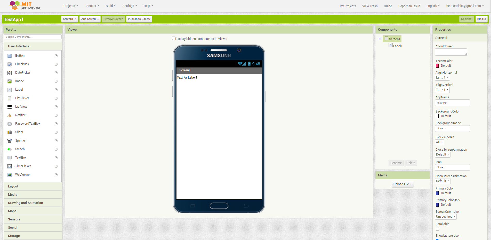

# AI Custom Mockup
This is a chrome browser extension which sets Samsung Galaxy Note 5 as default mockup of MIT Appinventor Creator. This is an output of a small challenge, that i took to add a custom phone mockup in MIT Appinventor Creator. It's done, but definetly there are some bugs and errors in this which i'll keep fixing as per your reports.

Note : I haven't published it on Chrome store due to,
- I don't have an account to publish 😅
- It's not yet ready to be published.

Anyone interested to contribute/join and help me in improving this extension, feel free to modify the codes.

## How to use?
As you know it's not yet published on **Chrome Store** so you have to download this extension as zip and then extract it in a folder (you can name it anything). Now you'll have follow these 3 simple step

In step3, just simply select the folder where you have extracted the zip of this extension.
All Set now open a new tab and goto http://ai2.appinventor.mit.edu/ (You can reload the tab if you are already on creator).

Enjoy!!
